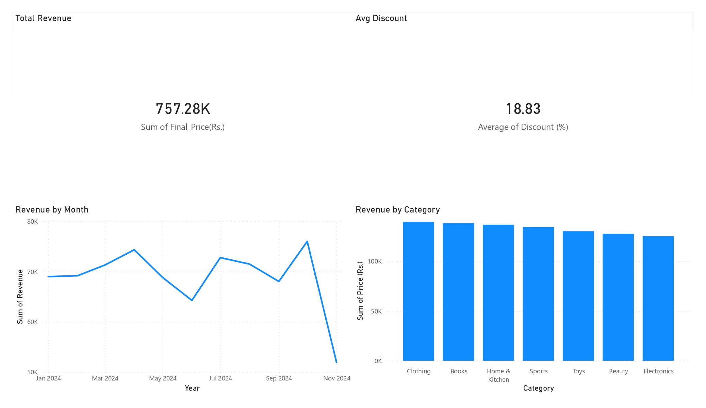
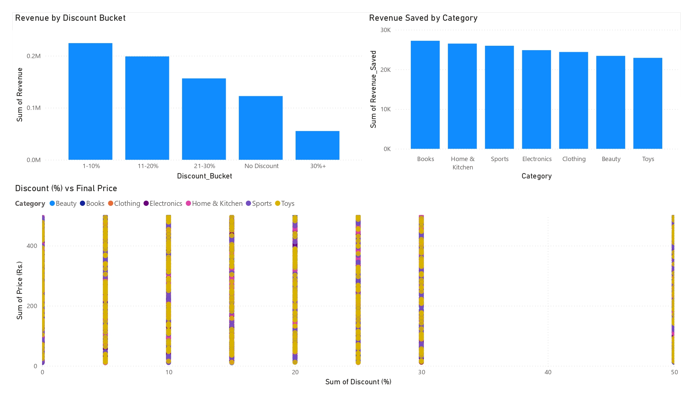
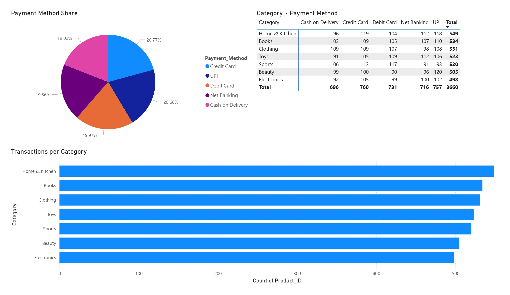

# E-Commerce Sales Analysis & Dashboard

## Project Overview

This project analyzes e-commerce transaction data to uncover trends in revenue performance, pricing strategy effectiveness, product category contribution, and payment behavior.

The objective was to simulate a real-world junior data analyst workflow — transforming raw transaction data into structured insights that support business decision-making.

The dataset was cleaned, engineered, and analyzed using Python, then visualized in a Power BI dashboard to communicate findings clearly and professionally.

---

## Tools & Technologies

* Python (Pandas, Matplotlib, Seaborn)
* Jupyter Notebook
* Power BI
* Git & GitHub for version control

---

## Data Preparation

The dataset was imported and processed in Python to:

* Convert purchase dates into proper datetime format
* Rename revenue fields for clarity
* Engineer new analytical features:

  * `Revenue_Saved`
  * `Discount_Bucket`
  * Monthly aggregation column
* Perform correlation analysis between pricing variables
* Export a cleaned dataset for dashboard integration

The processed dataset was then used to build the Power BI dashboard.

---

## Dashboard Preview

### Overview

### Pricing & Discount Analysis

### Category & Payment Insights

---

## Dashboard Features

The Power BI dashboard includes:

* **Total Revenue KPI**
* **Average Discount KPI**
* Monthly revenue trend analysis
* Revenue by product category
* Revenue by discount level
* Discount vs Revenue scatter visualization
* Payment method distribution
* Category vs payment behavior matrix

These visuals allow quick identification of pricing dynamics, category performance, and revenue drivers.

---

## Key Insights

* Revenue is strongly driven by product price (correlation = 0.94).
* Discount percentage has a moderate negative relationship with revenue (-0.31).
* Moderate discounts (10–20%) balance transaction volume without significantly reducing revenue.
* Clothing is the highest revenue-generating category.
* Revenue shows mild cyclical seasonal behavior with recovery phases following dips.

---

## Repository Structure

* `data/` → raw and processed datasets
* `notebooks/` → Python analysis notebook
* `dashboard/` → Power BI dashboard file
* `visuals/` → exported dashboard screenshots
* `requirements.txt` → Python dependencies

---

## Author

Harold Ramos
Computer Engineering Student